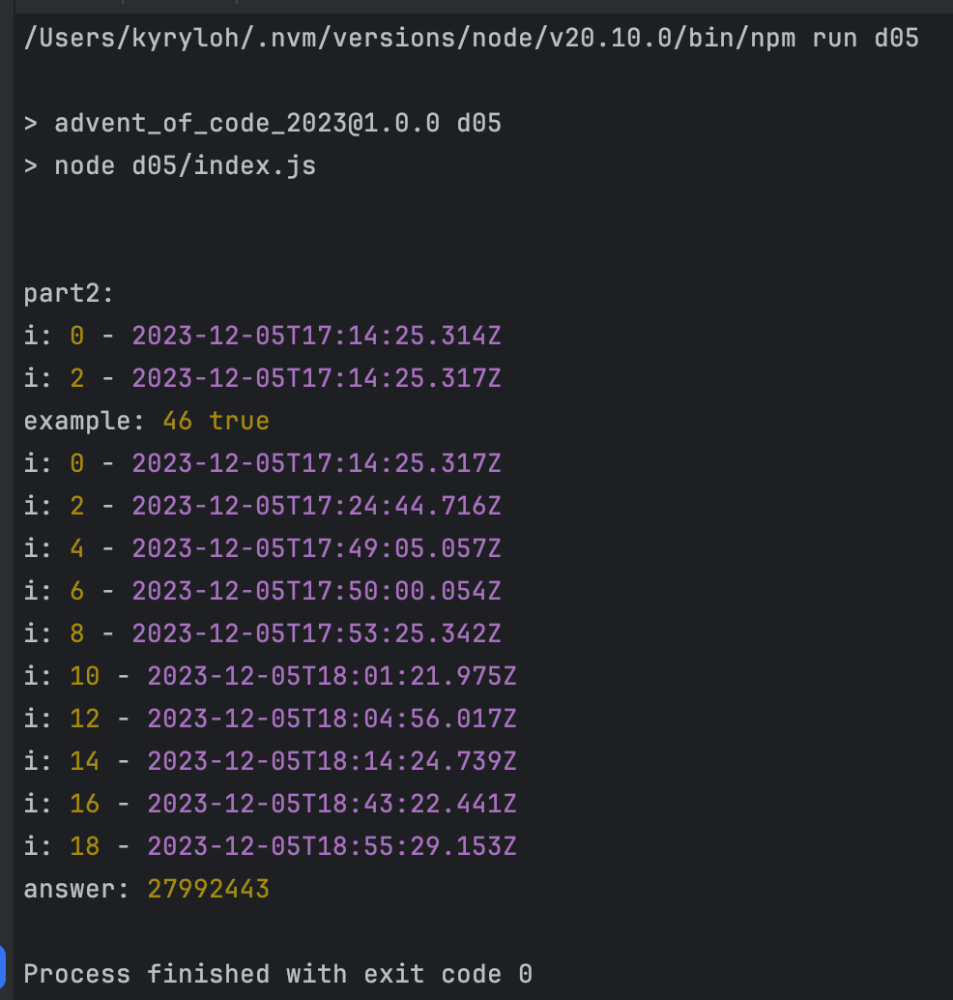

# advent_of_code_2023

[Advent of Code 2023](https://adventofcode.com/2023)

### [--- Day 1: Trebuchet?! ---](https://adventofcode.com/2023/day/1)

```bash
$ npm run d01
```

### [--- Day 2: Cube Conundrum ---](https://adventofcode.com/2023/day/2)

```bash
$ npm run d02
```

### [--- Day 3: Gear Ratios ---](https://adventofcode.com/2023/day/3)

```bash
$ npm run d03
```

### [--- Day 4: Scratchcards ---](https://adventofcode.com/2023/day/4)

```bash
$ npm run d04
```

### [--- Day 5: If You Give A Seed A Fertilizer ---](https://adventofcode.com/2023/day/5)

> [!NOTE]
> This one is a bit slow. Be patient, I waited 1 hour and 41 minutes for the part 2.


```bash
$ npm run d04
```
